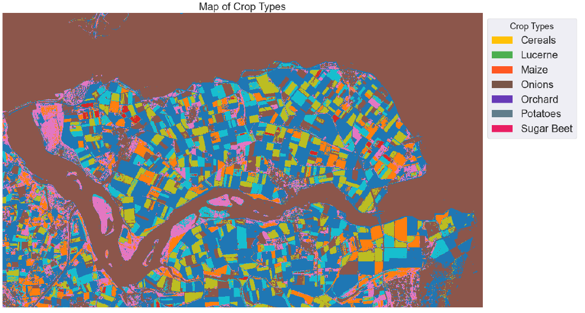
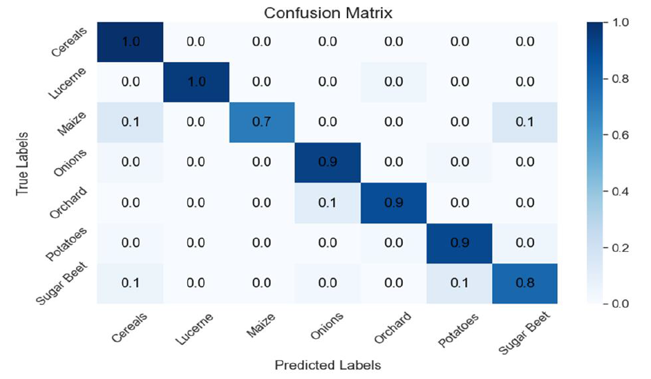
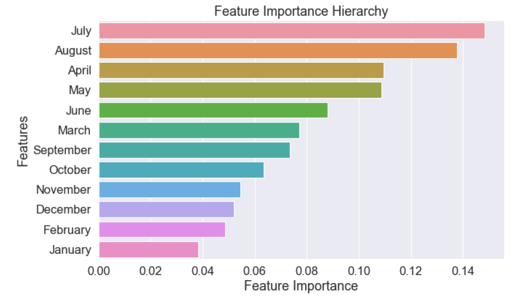

# Crop Type Classification Using Multi-temporal NDVI and Random Forest

## Project Overview

This project focuses on the classification of crop types using multi-temporal Normalized Difference Vegetation Index (NDVI) images and a Random Forest Classifier. The study leverages remote sensing and machine learning techniques to map different crop types based on spectral vegetation indices. The dataset includes Sentinel-derived NDVI images and labeled crop sampling points.

## Features

- **Geospatial Data Processing**: Uses `rasterio`, `geopandas`, and `fiona` for handling raster and vector geospatial data.
- **Feature Extraction**: Extracts spectral signatures from multi-temporal NDVI bands.
- **Random Forest Classification**: Implements hyperparameter tuning to optimize classification accuracy.
- **Accuracy Assessment**: Evaluates model performance using confusion matrix, producer accuracy, user accuracy, and Cohen’s kappa coefficient.
- **Feature Importance Analysis**: Identifies key months contributing to crop classification.
- **Visualization**: Generates maps of classified crop types and plots for accuracy metrics.

## Dataset

- **NDVI Raster Stack**: 12 bands corresponding to monthly NDVI values for the study region (Noord Beveland, Netherlands).
- **Sampling Points**: 929 labeled crop field samples representing seven crop types (*Cereals, Lucerne, Maize, Onions, Orchard, Potatoes, and Sugar Beet*).

## Project Workflow

1. **Data Inspection & Preprocessing**: Reads and visualizes NDVI layers and sampling points.
2. **Feature Extraction**: Extracts spectral information from raster images for training.
3. **Model Training & Optimization**: Implements hyperparameter tuning for `n_estimators` and `max_features`.
4. **Accuracy Assessment**: Evaluates classification results and generates confusion matrices.
5. **Feature Importance Analysis**: Ranks NDVI months based on their importance in classification.
6. **Full Image Prediction & Output**: Applies the trained model to classify the entire raster dataset.

## Results

- Achieved an **overall accuracy of 93.18%**.
- Identified **July, August, April, and May** as the most influential NDVI months for crop classification.
- Successfully mapped agricultural fields into seven crop types.

## Example Images

## Example Images

### 1. Crop Type Distribution Map


### 2. Confusion Matrix


### 3. Feature Importance Analysis



## Technologies Used

- **Python**: Primary programming language.
- **Libraries**: `rasterio`, `geopandas`, `matplotlib`, `seaborn`, `numpy`, `pandas`, `scikit-learn`, `fiona`.
- **Machine Learning**: Random Forest Classifier for supervised classification.

## How to Use the Code

### 1. Clone the Repository

```sh
git clone https://github.com/yourusername/crop-classification.git
cd crop-classification
```

### 2. Install Dependencies

```sh
pip install -r requirements.txt
```

### 3. Run the Script

```sh
python s3003337_python_solution.py
```

## How to Reuse This Code

This script can be adapted for other geospatial classification problems. To reuse it:
Checkout the manual [s3003337_Manual.pdf](s3003337_Manual.pdf)
- **Modify Input Data**: Replace the NDVI raster and sampling points with your dataset.
- **Adjust Hyperparameters**: Optimize Random Forest parameters based on your dataset.
- **Change Feature Names**: Update crop type names and band names as needed.
- **Expand Functionality**: Modify visualization, add new classifiers, or integrate deep learning methods.

## Source Code

📌 **View the Python Script**

## References

- **Zheng et al. (2015)**: A support vector machine to identify irrigated crop types using time-series Landsat NDVI data.
- **Tatsumi et al. (2015)**: Crop classification of upland fields using Random Forest of time-series Landsat 7 ETM+ data.
